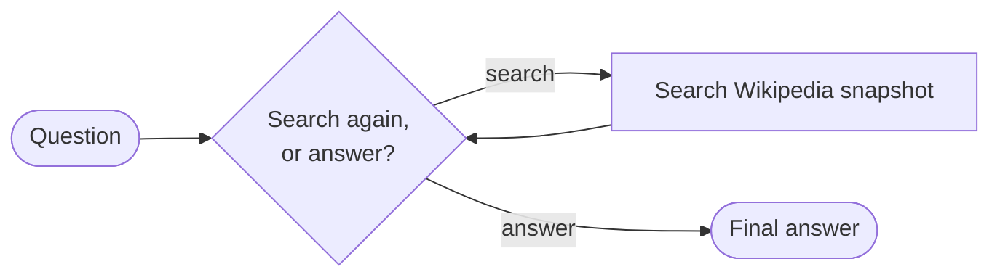
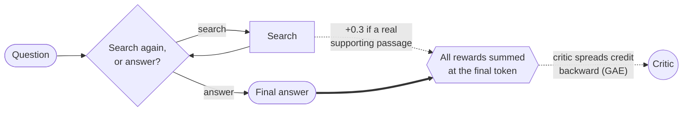
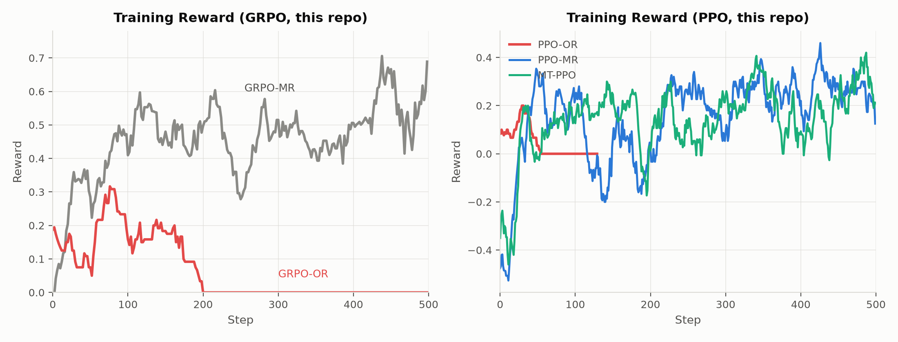
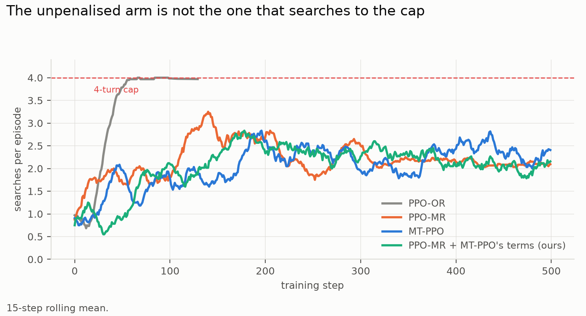

# Training Outcome vs. Turn-Level Reward for Multi-Turn Agents

**Goal**: determine whether rewarding a model's intermediate actions, not just its final answer,
produces a measurably better multi-turn search agent.

**Why this matters.** RL algorithms like GRPO and PPO are the standard way to train the language
models that drive multi-turn agents, and they usually optimize a sparse outcome reward: one number,
right or wrong, at the very end of a long trajectory. That gives the model no signal about which of
its intermediate actions (like a good search) actually helped. The paper this repo is inspired by found that adding
a dense, turn-level reward signal on top of the same algorithms fixes that: more stable training,
faster convergence, and higher accuracy than sparse-reward baselines. This repo tests whether that
holds up at a much smaller scale.

Inspired by ["Reinforcing Multi-Turn Reasoning in LLM Agents via Turn-Level Reward
Design"](https://arxiv.org/abs/2505.11821) (arXiv:2505.11821), specifically its GRPO and PPO case
study. The reward designs below follow the paper's own definitions; experiments of my own are
labelled as such and kept separate from the reproduction.

**Biggest deviation**: a much smaller model on a single consumer GPU — `Qwen3.5-0.8B` on one
NVIDIA RTX 4090, vs. the paper's `Qwen2.5-7B` on 8 NVIDIA H100s — with a batch size 128× smaller.
HotpotQA is one of the paper's own six evaluation datasets; this repo uses it exclusively, for
its genuinely multi-hop questions. Retrieval is BM25 rather than the paper's dense E5. Every arm
here is also a single run (n=1); the paper averages five runs for its training curves, so
seed-to-seed variance here is unmeasured.
Smaller deviations are noted inline.

## The Agent

The agent here is a **language model inside a harness**: at each turn the model decides
whether to search a Wikipedia snapshot (a fixed, offline copy, not the live site) or give a final
answer. Different rollouts of the same question can end up searching a different number of times.

What RL updates is only the **model's weights**. The harness around it — the tool-calling loop,
the system prompt, the retrieval backend, the 4-turn cap — is identical in every condition below
and is never trained. Only the reward function differs, so any difference in results is attributable
to the reward design rather than to the agent's architecture.



## Reward approaches explored

GRPO computes **one** advantage per trajectory and applies that identical value to every token in
every turn. A sharp search followed by a garbled answer, and a lazy search followed by a lucky
guess, get scored no differently turn-by-turn. GRPO can't isolate which turn earned the credit.

That holds no matter *where* you attach a bonus. GRPO only ever sees one number per trajectory, so
a bonus placed mid-episode still gets folded into that same number. Actually using *where* a reward
happened requires a way to value each point in a trajectory on its own. PPO's critic does exactly
that; GRPO would need extra per-turn rollouts (the paper's `MT-GRPO`, out of scope here). That's
why the later approaches switch to PPO rather than just rearranging the reward.

Each approach below uses the paper's own reward definitions (arXiv:2505.11821 §5.2/§6.1).

### 1. `GRPO-OR` — outcome only


> **Reward:** `R = 1.0 if exact_match else 0.0` — binary, terminal, nothing for search.

### 2. `GRPO-MR` — merged reward


> **Reward:** `R = R^O + 0.3 × retrieval_fraction` — one scalar, still terminal, where
> `R^O = +1.0` correct+format / `+0.2` wrong+format / `−1.0` bad format.

The retrieval bonus checks whether a search surfaced one of the specific Wikipedia articles a human
annotator marked as necessary, independent of whether the final answer came out right.

### 3. `PPO-OR` — the same outcome-only reward, scored by a critic

Same reward as `GRPO-OR`, different algorithm: no group comparison, just a learned value function
estimating expected return token-by-token.


> **Reward:** `R = 1.0 if exact_match else 0.0`, placed at the last token.

### 4. `PPO-MR` — merged reward, with a critic

The paper's PPO baseline. The critic spreads credit backward, but the reward itself says nothing
about *when* it was earned.



> **Reward:** `R = R^O + Σ(0.3 × retrieval hits)`, **all placed at the last token**.

### 5. `MT-PPO` — turn-level credit assignment

The paper's best method. Placing each turn's reward **at the turn that earned it** is what makes
the critic's value estimate differ turn-by-turn.


> **Reward:** `R^I = 0.3·retrieval_hit + format(+0.1 / −0.2) − 0.1·(searches so far)` at **each
> turn boundary**, plus `R^O` at the last token.

Note what `R^I` contains that `PPO-MR` does not: a per-turn format term and a search-count penalty.

## Results

Every arm below: same model, same scaffold, same seed, same dataset, 500 training steps,
evaluated on the same 7,404 held-out questions. Within each algorithm's track, only the reward
differs; across the GRPO/PPO divide the algorithm differs too, by design.

| Arm | Held-out EM | What happened |
|---|---|---|
| `GRPO-OR` | 0.000 | Collapsed — no gradient at all after step 184 |
| `GRPO-MR` | 0.295 | Worked |
| `PPO-OR` | 0.002 | Collapsed — searched forever, stopped answering¹ |
| `PPO-MR` | 0.235 | Worked |
| `MT-PPO` | 0.274 | Worked — the paper's best method |

¹ Stopped early and evaluated at its last checkpoint before collapse.


Absolute scores were never going to match the paper's: this model is **8.75× smaller** on a batch
**128× smaller**, and the paper's *untrained* `Qwen2.5-7B` already scores EM 0.160–0.292 — their
model starts about where mine finishes. What is comparable is the structure: which rewards work,
which collapse, and by how much.

### Why my `GRPO-OR` and `PPO-OR` collapsed when the paper's didn't

Same reward, opposite fates — the only thing that changed is scale:

| Run | Paper (Qwen2.5-7B, 8×H100) | Mine (Qwen3.5-0.8B, 1×RTX 4090) |
|---|---|---|
| `PPO-OR` | 0.435 EM | 0.002 EM |
| `GRPO-OR` | 0.331 EM | 0.000 EM |



Why mine and not the paper's? My best guess is scale. A batch with zero correct answers teaches
nothing — every rollout scores the same, so the gradient is zero — and that gets more likely as
the model gets weaker and the batch gets smaller. Mine is much smaller on both: a 0.8B model
against the paper's 7B, and a batch 128× smaller (one RTX 4090 against their 8 H100s).
Unverified: I never ran the paper's scale. The test: step up through the model family (Qwen3.5 ships 2B and 4B)
and see where the collapse stops.

### A search penalty is not what prevents runaway searching

`MT-PPO` is penalized for each search; the other two arms are not. The paper says that without
this penalty, models search out of control.



Half of this matches the paper: runaway searching is real — `PPO-OR` climbed to the 4-search cap
and stayed there. The other half doesn't: the paper blames the missing penalty, but `PPO-MR` is
missing it too and settled at about 2 searches per question, same as the penalized `MT-PPO`. My
guess at why: what `PPO-OR` uniquely lacks isn't the penalty but any reward for answering — it
gets nothing unless the answer is exactly right, so it had no reason to ever stop, while `PPO-MR`
gets a small reward for any well-formed answer, so stopping always pays a little.

### The paper's headline result reproduced

The paper's headline is that delivering rewards at the turn that earned them beats saving them
all for the end — `MT-PPO` beats `PPO-MR`. The same thing happened here, on a model roughly a
tenth the size: `MT-PPO` answered more questions exactly right and followed the answer format
more reliably (numbers in the table above). Every arm is a single run, so trust the direction
more than the size of the gap.

## Future work

- **LLM-as-judge reward.** The paper's other turn-level signal — a model scores the turn instead of
  the verifiable retrieval check used here. Not started; the paper reports no benchmark number for
  it either, so there's no published score to check against.

## Citation

If you use this repo or build on its experiments, please cite the paper it is based on:

> Quan Wei, Siliang Zeng, Chenliang Li, William Brown, Oana Frunza, Wei Deng, Anderson Schneider, Yuriy Nevmyvaka, Yang Katie Zhao, Alfredo Garcia, and Mingyi Hong. *Reinforcing Multi-Turn Reasoning in LLM Agents via Turn-Level Reward Design.* arXiv:2505.11821, 2025. [https://arxiv.org/abs/2505.11821](https://arxiv.org/abs/2505.11821)

```bibtex
@misc{wei2025reinforcingmultiturnreasoningllm,
  title={Reinforcing Multi-Turn Reasoning in LLM Agents via Turn-Level Reward Design},
  author={Quan Wei and Siliang Zeng and Chenliang Li and William Brown and Oana Frunza and Wei Deng and Anderson Schneider and Yuriy Nevmyvaka and Yang Katie Zhao and Alfredo Garcia and Mingyi Hong},
  year={2025},
  eprint={2505.11821},
  archivePrefix={arXiv},
  primaryClass={cs.LG},
  url={https://arxiv.org/abs/2505.11821},
}
```

## Contributing

See [CONTRIBUTING.md](CONTRIBUTING.md) for dev setup, quality gates, and running tests.
