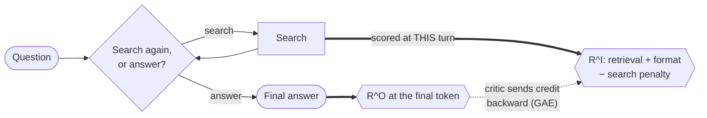

# Outcome vs. Turn-Level Reward for Multi-Turn Search Agents

**Goal**: determine whether rewarding a model's intermediate actions, not just its final answer,
produces a measurably better multi-turn search agent.

**Why this matters.** RL algorithms like GRPO and PPO are the standard way to train the language
models that drive multi-turn agents, and they usually optimize a sparse outcome reward: one number,
right or wrong, at the very end of a long trajectory. That gives the model no signal about which of
its intermediate actions (like a good search) actually helped. The paper this repo is inspired by found that adding
a dense, turn-level reward signal on top of the same algorithms fixes that: more stable training,
faster convergence, and higher accuracy than sparse-reward baselines. This repo tests whether that
holds up at a much smaller scale.

Inspired by ["Reinforcing Multi-Turn Reasoning in LLM Agents via Turn-Level Reward
Design"](https://arxiv.org/abs/2505.11821) (arXiv:2505.11821), specifically its GRPO and PPO case
study. All five reward designs below follow the paper's own definitions; experiments of our own are
labelled as such and kept separate from the reproduction.

**Biggest deviation, and it dominates the absolute numbers**: a much smaller model on a single
consumer GPU — `Qwen3.5-0.8B` on one NVIDIA RTX 4090, vs. the paper's `Qwen2.5-7B` on 8 NVIDIA
H100s — with a batch size 128× smaller. HotpotQA is one of the paper's own six evaluation datasets
(its in-domain one); this repo uses it exclusively, for its genuinely multi-hop questions.
Retrieval is BM25 rather than the paper's dense E5. Smaller deviations are noted inline.

## The agent

The agent here is a **language model inside a fixed scaffold**: at each turn the model decides
whether to search a Wikipedia snapshot (a fixed, offline copy, not the live site) or give a final
answer. Different rollouts of the same question can end up searching a different number of times.

What RL updates is only the **model's weights**. The scaffold around it — the tool-calling loop,
the system prompt, the retrieval backend, the 4-turn cap — is identical in every condition below
and is never trained. Only the reward function differs, so any difference in results is attributable
to the reward design rather than to the agent's architecture.


## Reward approaches explored

GRPO computes **one** advantage per trajectory and applies that identical value to every token in
every turn. A sharp search followed by a garbled answer, and a lazy search followed by a lucky
guess, get scored no differently turn-by-turn. GRPO can't isolate which turn earned the credit.

That holds no matter *where* you attach a bonus. GRPO only ever sees one number per trajectory, so
a bonus placed mid-episode still gets folded into that same number. Actually using *where* a reward
happened requires a critic that can evaluate any point in a trajectory on its own. PPO has one;
GRPO doesn't. That's why the last three approaches switch algorithms rather than just rearranging
the reward.

Five approaches, in increasing order of how directly they solve it. All five use the paper's own
reward definitions (arXiv:2505.11821 §5.2/§6.1), and share this outcome reward:

```
R^O  =  +1.0   correct answer, correct format
        +0.2   wrong answer, correct format
        −1.0   incorrect format
```

### 1. `GRPO-OR` — outcome only

Reward = final-answer correctness, nothing else. Search behavior gets no direct signal at all.


> **Reward:** `R = 1.0 if exact_match else 0.0` — binary, terminal, nothing for search.

### 2. `GRPO-MR` — merged reward

Adds a bonus for surfacing a real supporting passage, but folds it into the *same* single
trajectory-level number. Denser signal; the advantage is still spread uniformly across every token.


> **Reward:** `R = R^O + 0.3 × retrieval_fraction` — one scalar, still terminal.

The retrieval bonus checks whether a search surfaced one of the specific Wikipedia articles a human
annotator marked as necessary, independent of whether the final answer came out right.

### 3. `PPO-OR` — the same outcome-only reward, scored by a critic

Same reward as `GRPO-OR`, different algorithm: no group comparison, just a learned value function
estimating expected return token-by-token.


> **Reward:** `R = 1.0 if exact_match else 0.0`, placed at the last token.

### 4. `PPO-MR` — merged reward, with a critic

The paper's PPO baseline. Adds retrieval correctness, but still sums everything into the final
token — the critic spreads it backward, but the reward itself says nothing about *when* it was
earned.


> **Reward:** `R = R^O + Σ(0.3 × retrieval hits)`, **all placed at the last token**.

### 5. `MT-PPO` — turn-level credit assignment

The paper's best method. Same components, but each turn's reward is placed **at the turn that
earned it** (Eq. 9), so the critic's value estimate differs turn-by-turn.



> **Reward:** `R^I = 0.3·retrieval_hit + format(±0.1 / −0.2) − 0.1·n_searches` at **each turn
> boundary**, plus `R^O` at the last token.

Note what `R^I` contains that `PPO-MR` does not: a per-turn format term and a search-count penalty.
Those are MT-PPO's own contribution, not baseline components — which turns out to matter a lot
(see [Result 3](#3-what-the-papers-turn-level-gain-actually-contains)).

### How this reproduction compares to the paper


All five arms, trained at seed 42 for 500 steps and evaluated on the same 7,404 held-out questions.
**Format correctness tracks the paper closely; exact match sits systematically below it.** That
split is what you'd expect from the one deviation that dominates everything else: the paper trains
`Qwen2.5-7B`, this repo trains `Qwen3.5-0.8B` — **8.75× smaller**. Format is a dense per-episode
signal that saturates quickly; exact match is sparse and hard, and is what the paper's much larger
model and 128× larger batch actually buy.

For scale: the paper reports its *untrained* `Qwen2.5-7B` at EM **0.160**, and its instruct variant
at **0.292**. This repo's best *trained* arm reaches **0.301** — roughly where the paper's model
starts.

## Results

| Arm (held-out, 7,404 questions) | Exact match | F1 | Format | Retrieval |
| ------------------------------- | ----------- | ---- | ------ | --------- |
| `PPO-OR`* | 0.002 | 0.002 | 0.003 | 0.529 |
| `PPO-MR`  | 0.235 | 0.301 | 0.642 | 0.551 |
| `MT-PPO`  | **0.274** | **0.362** | **0.830** | 0.521 |
| `GRPO-OR` | 0.000 | 0.015 | 0.421 | — |
| `GRPO-MR` | **0.295** | **0.391** | **0.975** | 0.475 |

`*` `PPO-OR` collapsed during training, so it is scored at its last checkpoint before collapse —
the paper's own stated methodology for its crashed PPO baselines. `GRPO-OR` has no retrieval figure
because its reward never inspects retrieval, so the metric was not computed for that arm.

Six training runs (~14 GPU-hours) and seven full held-out evaluations (~45 GPU-hours) on one
RTX 4090. Every arm ran 500 steps at seed 42 with identical hyperparameters; the arms took 488-495
real gradient updates each, and no episode in any PPO arm ended without a chance to answer — the
symmetry checks that make the comparison worth reading at all.

### 1. Turn-level reward reproduces — and the effect is larger here than in the paper

`PPO-MR → MT-PPO` gains **+0.039 exact match** and **+0.187 format correctness**. The paper reports
+0.017 EM for the same step. Right direction, larger magnitude.

The same pattern holds on the GRPO side, where the merged reward is the only thing keeping the arm
alive at all: `GRPO-OR → GRPO-MR` goes from **0.000 to 0.295** EM.

### 2. A binary outcome reward can stop training permanently


Both binary-outcome-only arms — `PPO-OR` and `GRPO-OR`, two *different algorithms* — died the same
structural death. `GRPO-OR` is the cleaner illustration because the mechanism is directly visible:

- After step 184, reward is **exactly 0** and `frac_reward_zero_std` is pinned at **1.000**: every
  rollout in every group scores identically.
- GRPO's advantage is `(rᵢ − group mean) / group std`. When every rollout scores the same, the
  advantage is zero, so **`grad_norm` is exactly 0.0000 for the remaining 300 steps**. Checkpoints
  450 and 500 are byte-identical.
- On held-out data the frozen policy **never called search once** across all 7,404 questions.

`PPO-OR` failed differently but for the same reason — it reached format compliance of **0.003**
while posting the *highest retrieval of any arm* (0.529). It learned to search, and then never
answered. High retrieval on a dead arm is what "search forever, never commit" looks like.

This is a small-scale effect, not a refutation: the paper's `PPO-OR` reaches 0.435 EM. The trigger
is the probability that a batch contains **zero** correct answers, `(1−p)^N` — a smaller model
lowers `p`, a smaller batch lowers `N`, and they compound in the same exponent. At `p≈0.16` and
`N=512` an all-zero batch essentially never happens. At ours it is routine.

### 3. What the paper's turn-level gain actually contains


The paper's `PPO-MR → MT-PPO` step changes **two things at once**: it adds reward components (a
per-turn format term and a search penalty) *and* moves them to turn boundaries. So its published
gain can't attribute credit between them.

We have the missing control: the same reward content as `MT-PPO`, but flattened to the final
token. It scores **0.301 EM** — higher than either published arm — which separates the two changes:

| Change | Effect on held-out EM |
| ------ | --------------------- |
| Add `λs` + per-turn format **content** | **+0.066** |
| Move that content to **turn boundaries** (Eq. 9) | **−0.027** |
| **Net** (= the paper's own comparison) | **+0.039** |

**At this scale the reward components do the work, and turn-level placement gives some of it back.**
The published net gain is real, but it is the sum of a large positive and a smaller negative — not a
single effect.

Neither effect can be explained by evaluation noise: both evaluations are deterministic and
reproduce bit-identically, and on sampling error alone the gaps are ~9 SE and ~3.7 SE. But that is
the *wrong* error bar to lean on — the dominant uncertainty is seed-to-seed training variance, which
one seed cannot estimate at all. So: the content effect is large enough to survive a lot of it; the
placement effect is **suggestive, not settled**.

> This control was not planned. `ppo_mr` was built as a "cleaner" PPO-MR before the paper's actual
> definition was checked, and the error was caught only when its results were written up — at which
> point the first pass had already concluded, wrongly, that the paper's central claim *didn't*
> reproduce. Re-running the faithful baseline reversed that. The accidental arm turned out to be the
> useful one, but the lesson is the opposite of comfortable: **reproduce faithfully first, then
> improve.**

### 4. A search penalty is not what prevents runaway searching

The paper warns that removing its search-count penalty "leads to unstable training and degenerate
behaviors, such as uncontrolled search usage." `PPO-MR` runs with **λs = 0** by the paper's own
definition — and searched *less* than the penalized arms (2.10 turns/episode vs 2.04 and 2.39), far
from the 4-turn cap that collapsed `PPO-OR` saturated.

What actually bounds search is the **graded** outcome reward: a wrong-but-formatted answer still
earns +0.2, so there is always positive pressure to stop searching and commit. `PPO-OR` had no such
term, and that — not the missing penalty — is what let it search forever.

### 5. Reward hacking under an added penalty (our own experiments)

Separately from the reproduction, we stress-tested a GRPO variant using **graded** partial credit
(F1 + exact-match bonus) instead of the paper's binary reward, under three manufactured pressures.

**These runs are not comparable to the table above** — different reward, different seed (123), and
600 steps rather than 500. They are their own self-contained experiment, with their own internal
baseline: **0.242 EM** outcome-only vs **0.306** merged.


**None improved on the baseline**, and *how* they failed is the same lesson as Result 2 — this time
triggered by an added penalty rather than a missing bonus:

- **Length penalty** (not from the paper): outcome-only **collapsed to 0.090 EM**, garbled text.
  Merged reward dropped only to 0.254 and stayed coherent.
- **The paper's search-count penalty, borrowed into GRPO**: outcome-only **collapsed to 0.024 EM**.
  Merged reward fell to 0.221, then partially recovered late in training.
- **Isolating control** (same prompt change, *no* penalty): outcome-only dropped only to 0.201;
  merged reward *rose* to 0.320. This pins both collapses on the penalty term itself.

If every rollout in a group finds the same cheap trick, GRPO can't see past it — the whole group
looks equally bad, so there's no gradient saying it's wrong. A bare penalty with no matching
positive incentive is genuinely risky under GRPO. Merged reward's extra signal is real but
**incomplete** protection.

<details>
<summary>Methodology notes and caveats</summary>

- **Significance.** The 0.065 EM gap in the graded-reward GRPO baseline is p < 1e-18 (z ≈ 8.8),
  95% CI ≈ [0.050, 0.079], treating conditions as independent samples. Result 5's follow-ups are
  single runs without significance tests; the effects there are 3–10× collapses, not the kind of
  gap run-to-run noise produces.
- **Evaluation is deterministic.** Both PPO evaluations were run twice on the same checkpoints and
  reproduced **bit-identically to 16 decimal places** (greedy decoding). All remaining uncertainty
  is training-run variance, not measurement error.
- **Seeds.** n=1 against the paper's n=5. Resolving a 1.7-point effect here would need ~6–12 seeds
  (110–220 GPU-hours), so the small placement effect is deliberately not over-claimed.
- **Cross-algorithm comparison is not valid here.** PPO and GRPO arms saw very different amounts of
  data (~1,964 vs ~250 distinct training prompts) because GRPO must spend its whole generation batch
  on one prompt to form a group baseline. The arms belong in one results table; a PPO-vs-GRPO
  *causal* claim does not follow from it.
- **Retrieval ceiling.** ~20% of HotpotQA's gold passage titles aren't in this Wikipedia snapshot,
  so retrieval fraction can't reach 1.0 even with perfect search.

</details>

### Key learnings

1. **Turn-level reward works, but less of the credit belongs to turn-level *placement* than the
   headline number suggests.** Reproducing the paper's gain (+0.039 EM) and then decomposing it
   showed the reward *content* contributing +0.066 and the placement itself −0.027. A published
   delta that moves two variables at once is worth decomposing before building on it.
2. **A sparse binary reward is not just slow to learn from — it can be an absorbing state.** When
   every rollout in a batch scores zero, GRPO's advantage is zero, the gradient is exactly zero, and
   nothing recovers. Two different algorithms hit this identically. Reward density is a
   *training-stability* property at small scale, not only an efficiency one.
3. **Diagnose the mechanism, not the symptom.** `PPO-OR` had the *best* retrieval of any arm and was
   completely broken. `PPO-MR` ran without the search penalty the paper says prevents runaway search
   and searched less than the penalized arms. Both headline metrics point the wrong way; only the
   per-step curves and gradient norms explain what actually happened.
4. **Reproduce faithfully before improving.** The first pass here measured turn-level placement
   against a "better" baseline of our own design and concluded the paper's central claim *didn't
   reproduce*. It did — the deviation was hiding it. The improved variant is genuinely useful, but
   only as an addition to the faithful reproduction, never as a substitute for it.


## Roadmap

- **Paper reproduction (all five reward designs).** Complete. Training and held-out evaluation done
  for `GRPO-OR`, `GRPO-MR`, `PPO-OR`, `PPO-MR` and `MT-PPO` at seed 42, evaluated on the same
  7,404 held-out questions (see Results above).
- **Our own experiments.** The content-vs-placement decomposition (Result 3) and the graded-reward
  GRPO stress tests (Result 5) are complete.
- **Multiple seeds.** Not run. n=1 against the paper's n=5; the small placement effect would need
  ~6-12 seeds to resolve, which is 110-220 GPU-hours on this hardware.
- **LLM-as-judge reward.** The paper studies two kinds of turn-level reward: *verifiable* (this
  repo's retrieval check, an objective test of whether a real supporting passage got surfaced) and
  *LLM-as-judge* (a model scores the turn instead). The judge variant is not yet started. Note the
  paper reports no benchmark number for its judge, so there is no published score to check against.

## Project structure

```
.
├── data/       # downloaded wiki-18 retrieval corpus + BM25 index (gitignored, multi-GB)
├── docs/       # phase docs, design specs, roadmap
├── outputs/    # training checkpoints + logs per condition (gitignored)
├── results/    # final held-out metrics + comparison plots (committed)
├── scripts/    # retrieval server, setup/verification, plotting (plot_phase7c.py, compare_runs.py)
├── src/        # the turn_level_rewards package (env, rewards, metrics, data, train, evaluate)
└── tests/      # unit tests (fast, no GPU, no live retrieval server)
```


## Getting started


### Prerequisites

- Python 3.13+
- `[uv](https://docs.astral.sh/uv/)`
- JDK 21 (needed by the retrieval server's Lucene bridge)

Two choices worth knowing before you set up: the model is a deliberately small `Qwen3.5-0.8B`
(fits one GPU, no distributed training), and retrieval hits a real ~21M-passage Wikipedia
snapshot rather than a small per-question pool (a closed pool would make retrieval trivially
easy to solve, not a real test).

```bash
uv sync
sudo apt install openjdk-21-jdk
```


### Retrieval server

Training and evaluation search a local BM25 server backed by the real wiki-18
Wikipedia dump (~21M passages). Set it up once:

```bash
bash scripts/setup_retrieval.sh   # downloads the wiki-18 BM25 index (+corpus if needed) into data/wiki18/
```

The script downloads the index, checks whether it also needs the separate
corpus file, and prints the exact command to launch the server, something
like:

```bash
uv run python scripts/retrieval_server.py \
    --index_path data/wiki18/bm25-repo/bm25 \
    --corpus_path data/wiki18/data00/jiajie_jin/flashrag_indexes/wiki_dpr_100w/wiki_dump.jsonl \
    --port 8000
```

Run that (in the background or a separate terminal, since it needs to stay up for
the rest of setup and for training/evaluation later), then confirm it's
working:

```bash
uv run python scripts/verify_retrieval.py
```

```
PASS: retrieval server is up, wired correctly, and returns real documents.
```


### Training

```bash
uv run python -m turn_level_rewards.train --condition outcome_only
uv run python -m turn_level_rewards.train --condition turn_level
```

The bare invocation above (no extra flags) runs at smoke-test scale: 8 rows, 2 steps, a real
`Qwen/Qwen3.5-0.8B` model against the retrieval server started above. Pass `--train-size`,
`--max-steps`, `--num-generations`, etc. explicitly for a full-scale run. Both conditions
log to the same [trackio](https://github.com/gradio-app/trackio) project
(`turn-level-rewards`). Run `trackio show --project turn-level-rewards` to view.

## Citation

If you use this repo or build on its experiments, please cite the paper it is based on:

> Quan Wei, Siliang Zeng, Chenliang Li, William Brown, Oana Frunza, Wei Deng, Anderson Schneider, Yuriy Nevmyvaka, Yang Katie Zhao, Alfredo Garcia, and Mingyi Hong. *Reinforcing Multi-Turn Reasoning in LLM Agents via Turn-Level Reward Design.* arXiv:2505.11821, 2025. [https://arxiv.org/abs/2505.11821](https://arxiv.org/abs/2505.11821)

```bibtex
@misc{wei2025reinforcingmultiturnreasoningllm,
  title={Reinforcing Multi-Turn Reasoning in LLM Agents via Turn-Level Reward Design},
  author={Quan Wei and Siliang Zeng and Chenliang Li and William Brown and Oana Frunza and Wei Deng and Anderson Schneider and Yuriy Nevmyvaka and Yang Katie Zhao and Alfredo Garcia and Mingyi Hong},
  year={2025},
  eprint={2505.11821},
  archivePrefix={arXiv},
  primaryClass={cs.LG},
  url={https://arxiv.org/abs/2505.11821},
}
```

## Contributing

See `[CONTRIBUTING.md](CONTRIBUTING.md)` for dev setup, quality gates, and running tests.
