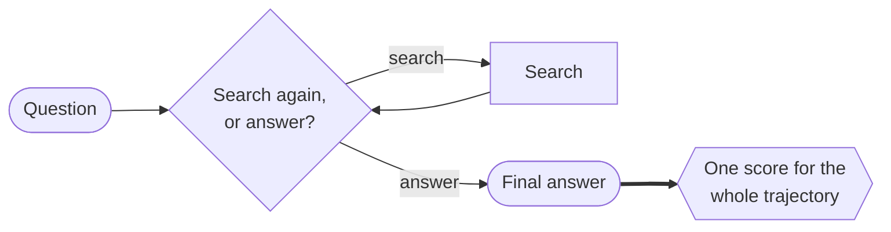
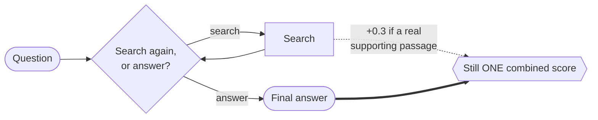
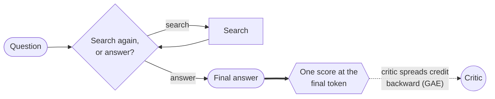
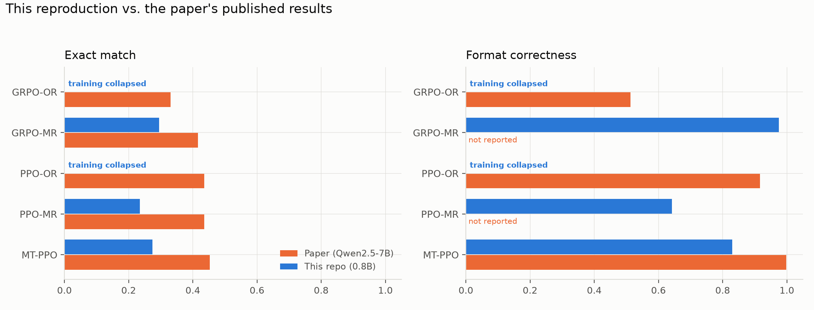
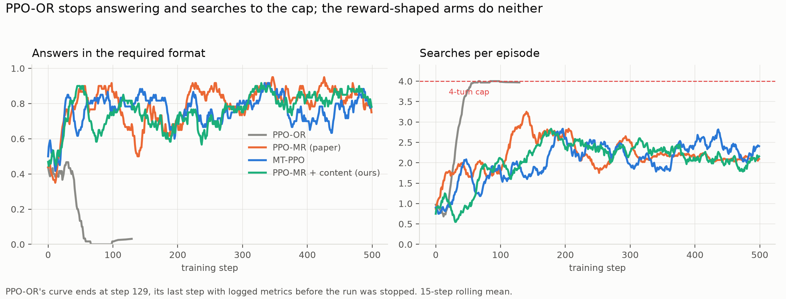
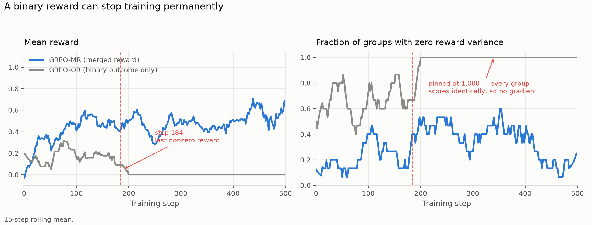
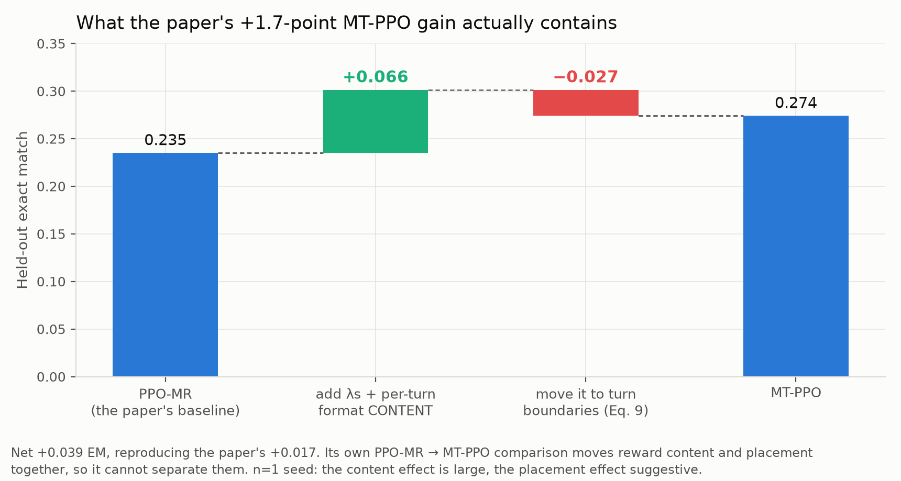
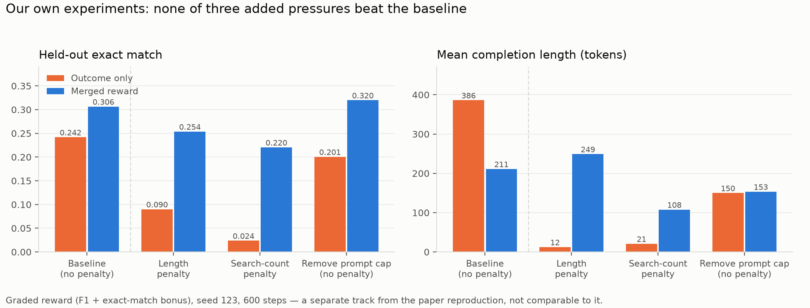

# Training Outcome vs. Turn-Level Reward for Multi-Turn Agents

**Goal**: determine whether rewarding a model's intermediate actions, not just its final answer,
produces a measurably better multi-turn search agent.

**Why this matters.** RL algorithms like GRPO and PPO are the standard way to train the language
models that drive multi-turn agents, and they usually optimize a sparse outcome reward: one number,
right or wrong, at the very end of a long trajectory. That gives the model no signal about which of
its intermediate actions (like a good search) actually helped. The paper this repo is inspired by found that adding
a dense, turn-level reward signal on top of the same algorithms fixes that: more stable training,
faster convergence, and higher accuracy than sparse-reward baselines. This repo tests whether that
holds up at a much smaller scale.

Inspired by ["Reinforcing Multi-Turn Reasoning in LLM Agents via Turn-Level Reward
Design"](https://arxiv.org/abs/2505.11821) (arXiv:2505.11821), specifically its GRPO and PPO case
study. The reward designs below follow the paper's own definitions; experiments of our own are
labelled as such and kept separate from the reproduction.

**Biggest deviation**: a much smaller model on a single consumer GPU — `Qwen3.5-0.8B` on one
NVIDIA RTX 4090, vs. the paper's `Qwen2.5-7B` on 8 NVIDIA H100s — with a batch size 128× smaller.
HotpotQA is one of the paper's own six evaluation datasets; this repo uses it exclusively, for
its genuinely multi-hop questions. Retrieval is BM25 rather than the paper's dense E5. Every arm
here is also a single run (n=1) against the paper's n=5, so seed-to-seed variance is unmeasured.
Smaller deviations are noted inline.

## The Agent

The agent here is a **language model inside a harness**: at each turn the model decides
whether to search a Wikipedia snapshot (a fixed, offline copy, not the live site) or give a final
answer. Different rollouts of the same question can end up searching a different number of times.

What RL updates is only the **model's weights**. The harness around it — the tool-calling loop,
the system prompt, the retrieval backend, the 4-turn cap — is identical in every condition below
and is never trained. Only the reward function differs, so any difference in results is attributable
to the reward design rather than to the agent's architecture.


## Reward approaches explored

GRPO computes **one** advantage per trajectory and applies that identical value to every token in
every turn. A sharp search followed by a garbled answer, and a lazy search followed by a lucky
guess, get scored no differently turn-by-turn. GRPO can't isolate which turn earned the credit.

That holds no matter *where* you attach a bonus. GRPO only ever sees one number per trajectory, so
a bonus placed mid-episode still gets folded into that same number. Actually using *where* a reward
happened requires a critic that can evaluate any point in a trajectory on its own. PPO has one;
GRPO doesn't. That's why the later PPO approaches switch algorithms rather than just rearranging
the reward.

Each approach below uses the paper's own reward definitions (arXiv:2505.11821 §5.2/§6.1).

### 1. `GRPO-OR` — outcome only



> **Reward:** `R = 1.0 if exact_match else 0.0` — binary, terminal, nothing for search.

### 2. `GRPO-MR` — merged reward



> **Reward:** `R = R^O + 0.3 × retrieval_fraction` — one scalar, still terminal, where
> `R^O = +1.0` correct+format / `+0.2` wrong+format / `−1.0` bad format.

The retrieval bonus checks whether a search surfaced one of the specific Wikipedia articles a human
annotator marked as necessary, independent of whether the final answer came out right.

### 3. `PPO-OR` — the same outcome-only reward, scored by a critic

Same reward as `GRPO-OR`, different algorithm: no group comparison, just a learned value function
estimating expected return token-by-token.



> **Reward:** `R = 1.0 if exact_match else 0.0`, placed at the last token.

### 4. `PPO-MR` — merged reward, with a critic

The paper's PPO baseline. The critic spreads credit backward, but the reward itself says nothing
about *when* it was earned.


> **Reward:** `R = R^O + Σ(0.3 × retrieval hits)`, **all placed at the last token**.

### 5. `MT-PPO` — turn-level credit assignment

The paper's best method. Placing each turn's reward **at the turn that earned it** is what makes
the critic's value estimate differ turn-by-turn.


> **Reward:** `R^I = 0.3·retrieval_hit + format(±0.1 / −0.2) − 0.1·n_searches` at **each turn
> boundary**, plus `R^O` at the last token.

Note what `R^I` contains that `PPO-MR` does not: a per-turn format term and a search-count penalty.

## Results

Every arm below: same model, same scaffold, same seed, same dataset, 500 training steps (except
`PPO-OR`, stopped once it had collapsed), evaluated on the same 7,404 held-out questions.
Only the reward differs.



Our exact-match scores sit well below the paper's, and they were never going to match: this trains
a model **8.75× smaller** on a batch **128× smaller**. The paper's own *untrained* `Qwen2.5-7B`
scores EM 0.160–0.292 — **roughly where our best trained arm lands.** Their model starts about
where ours finishes.

So absolute accuracy isn't the thing to read here. What survives the shrink is the **structure** —
which rewards produce a working model, which kill it outright, and how large the gaps between them
are. Everything below is about that.

### A binary outcome reward killed both arms that used it



Both binary-outcome-only arms — `PPO-OR` and `GRPO-OR`, two *different algorithms* — were killed by
the same cause, through **two different mechanisms**.

`PPO-OR` is visible above: it stops answering entirely and pins itself to the 4-turn search cap.
Scored at its last checkpoint before collapse — the paper's own methodology for its crashed
baselines — it reaches a format compliance of **0.003** while still retrieving as well as the arms
that worked (0.528, against 0.52 for `MT-PPO` and 0.55 for `PPO-MR`). It learned to search and
never learned to commit. Its gradient stayed alive the whole time — `policy_loss` is nonzero in
every one of its final 20 steps — so this is a degenerate policy, not a frozen one.



`GRPO-OR` failed harder, and its mechanism is exact. Once every rollout in a group scores
identically, GRPO's advantage — `(rᵢ − group mean) / group std` — is zero, so the gradient is
**exactly 0.0000 from step 186 to 499**. Checkpoints 450 and 500 are byte-identical, and the frozen
policy never called search once across all 7,404 held-out questions. Under GRPO specifically, a
sparse binary reward isn't just slow to learn from; it's an absorbing state you cannot leave. PPO's
critic spares it that — and still produced a model that never answers.

Adding the retrieval bonus is the whole difference between a dead model and a working one:
`GRPO-OR`'s **0.000** becomes `GRPO-MR`'s **0.295** EM, with nothing else changed.

This is a small-scale effect, not a refutation — the paper's `PPO-OR` reaches 0.435 EM. What
triggers it is the chance a batch contains **zero** correct answers, `(1−p)^N`: a smaller model
lowers `p`, a smaller batch lowers `N`, and they compound in the same exponent.

### A search penalty is not what prevents runaway searching

The paper warns that dropping its search-count penalty causes "uncontrolled search usage." `PPO-MR`
runs that penalty at **zero** by the paper's own definition — and, in the right-hand panel above,
sits near 2 searches per episode while the collapsed arm is the one glued to the cap.

What actually bounds search is the **graded** outcome reward: a wrong-but-formatted answer still
earns +0.2, so there is always positive pressure to stop searching and commit. `PPO-OR` had no such
term, and that — not the missing penalty — is what let it search forever.

### The paper's headline gain is two effects, not one

**The paper's headline result reproduced**: going from `PPO-MR` to `MT-PPO` gained **+0.039 exact
match** here, against the **+0.017** the paper reports. Right direction, larger effect.

But that step changes **two things at once**: it adds reward components (a per-turn format term and
a search penalty) *and* moves them to turn boundaries. Neither the paper's comparison nor ours can
say which one earned the credit.

Adding the missing control — the same reward content, flattened back to the final token — separates
them:



**At this scale the reward content does the work (+0.066) and turn-level placement gives some of it
back (−0.027).** The published net gain is real, but it is a large positive plus a smaller negative,
not a single effect. The content effect is big enough to survive a lot of seed variance; the
placement effect is **suggestive, not settled** at n=1.

### Our own experiment: a narrow reward is fragile to added penalties

Beyond the reproduction, we stress-tested a GRPO variant using **graded** partial credit (F1 +
exact-match bonus) instead of the paper's binary reward, under three manufactured pressures.



**None beat the baseline** — but *how* they failed is the finding. Under either penalty the
outcome-only arm collapsed to 12- and 21-token answers, while the merged reward degraded and stayed
coherent. A control with the same prompt change and *no* penalty held up fine, which pins the
collapses on the penalty term itself rather than on the prompt.

If every rollout in a group finds the same cheap trick, GRPO can't see past it — the whole group
looks equally bad, so no gradient says it's wrong. A bare penalty with no matching positive
incentive is genuinely risky under GRPO, and a denser reward is real but **incomplete** protection.

## Future work

- **LLM-as-judge reward.** The paper's other turn-level signal — a model scores the turn instead of
  the verifiable retrieval check used here. Not started; the paper reports no benchmark number for
  it either, so there's no published score to check against.

## Running it

Reproducing any of this needs a JDK and a multi-GB local Wikipedia index, since retrieval runs
against the real ~21M-passage wiki-18 dump rather than a per-question pool.
`scripts/setup_retrieval.sh` downloads the index and prints the server command.

Training entrypoints are `turn_level_rewards.train` for the GRPO arms and `turn_level_rewards.train_ppo`
for the PPO arms, each taking `--condition`. `scripts/plot_phase7c.py` regenerates every figure
above from committed data alone, with no GPU and no retrieval server.

## Citation

If you use this repo or build on its experiments, please cite the paper it is based on:

> Quan Wei, Siliang Zeng, Chenliang Li, William Brown, Oana Frunza, Wei Deng, Anderson Schneider, Yuriy Nevmyvaka, Yang Katie Zhao, Alfredo Garcia, and Mingyi Hong. *Reinforcing Multi-Turn Reasoning in LLM Agents via Turn-Level Reward Design.* arXiv:2505.11821, 2025. [https://arxiv.org/abs/2505.11821](https://arxiv.org/abs/2505.11821)

```bibtex
@misc{wei2025reinforcingmultiturnreasoningllm,
  title={Reinforcing Multi-Turn Reasoning in LLM Agents via Turn-Level Reward Design},
  author={Quan Wei and Siliang Zeng and Chenliang Li and William Brown and Oana Frunza and Wei Deng and Anderson Schneider and Yuriy Nevmyvaka and Yang Katie Zhao and Alfredo Garcia and Mingyi Hong},
  year={2025},
  eprint={2505.11821},
  archivePrefix={arXiv},
  primaryClass={cs.LG},
  url={https://arxiv.org/abs/2505.11821},
}
```

## Contributing

See `[CONTRIBUTING.md](CONTRIBUTING.md)` for dev setup, quality gates, and running tests.
